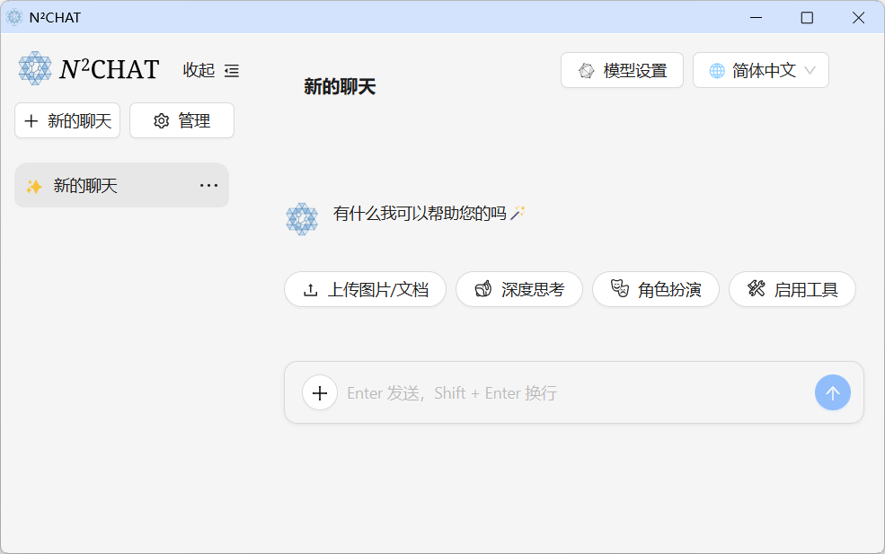

# *N*<sup>2</sup>CHAT：开源大模型助手，志在提供零门槛的丰富功能体验
### <i>Give me a </i>⭐<i>, Thanks </i>



## 路线图
- [ ] 长期记忆
- [ ] 知识库
- [x] 角色扮演
- [x] 工具调用（联网，绘图，代码执行）
- [x] 多模态对话、长文本解析


## 下载 *N*<sup>2</sup>CHAT
|| Windows 10 及以上 | 安卓 |
|---|---|---|
|国内镜像（Gitee）|[N²CHAT.zip]()|[N²CHAT.apk]()|
|Github|[N²CHAT.zip]()|[N²CHAT.apk]()|


## 配置 *N*<sup>2</sup>CHAT
点击主界面 `模型设置` 按钮，进入配置模型界面

你需要分别选择各个模型的服务商，并指定所要使用的模型

在 `账户信息` 一栏中，输入你各个平台的 API KEY。如果你还没有 API KEY，可以点击“获取 API KEY”按钮，前往注册各平台账户

> API KEY 是用户调用大模型平台服务所需的凭证，**模型服务的资费取决于各平台的计费政策，*N*<sup>2</sup>CHAT 与各平台不存在利益关联，亦未曾受到过任何资助**

以下是各接口与各服务商的具体说明：

||功能|BochaAI (博查)|Deepseek (深度求索)|Exa|Moonshot (月之暗面)|Qianfan (百度千帆)|Tongyi (通义千问)|备注|
|---|---|---|---|---|---|---|---|---|
|文字模型-常规模型|提供多数情境的对话能力|❌|✔️|❌|✔️|✔️|✔️||
|文字模型-高级模型|使用更高级的模型，提供进阶对话能力。可通过 `切换模型` 按钮启用|❌|✔️|❌|✔️|✔️|✔️||
|文字模型-长文本模型|用于解析长文本，需要上下文较大的模型|❌|✔️|❌|✔️|✔️|✔️||
|视觉模型|用于理解图像内容，实现多模态对话|❌|❌|❌|✔️|✔️|✔️||
|绘画模型|用于AI作画|❌|❌|❌|❌|✔️|✔️||
|搜索接口|用于查询网络信息|✔️|❌|✔️|❌|🔍|🔍|若使用自带搜索能力的文字模型（名称后带有“🔍”的模型），则不需要|

---
# *以下为开发人员内容*
## 部署 *N*<sup>2</sup>CHAT
```
git clone https://github.com/z-zeechung/next-next-chat.git
cd next-next-chat
npm install
```
- 在这之后，你需要将文件 `app\panels\testpage.template.tsx` 复制到 `app\panels\testpage.tsx`
- 受限于浏览器同源策略，在调试过程中，你可能需要用浏览器插件来覆写模型平台接口的响应头。你也可以尝试以 `--disable-web-security` 参数启动 Chrome 浏览器
- 最后：
```
npm run dev
```

## 编译 *N*<sup>2</sup>CHAT
```
// 导出静态网页资源
npm run export 
/** 导出任何平台的程序都需要先导出静态网页资源 */

// 导出 win64 程序
npm run export:win64

// 导出 android apk
// TODO
```

# Acknowledgment

- [**ChatGPT Next Web**](https://github.com/ChatGPTNextWeb/NextChat)
- [**Pyodide**](https://github.com/pyodide/pyodide)
- [**LangChain**](https://js.langchain.com/docs/introduction/)
- [**NeutralinoJS**](https://neutralino.js.org/)
- [**Ant Design**](https://ant.design/)
- [**PlexPt/awesome-chatgpt-prompts-zh**](https://github.com/PlexPt/awesome-chatgpt-prompts-zh)
- [**LouisShark/chatgpt_system_prompt**](https://github.com/LouisShark/chatgpt_system_prompt)
- [**B3o/GPTS-Prompt-Collection**](https://github.com/B3o/GPTS-Prompt-Collection)
- [**lobehub/lobe-chat-agents**](https://github.com/lobehub/lobe-chat-agents)